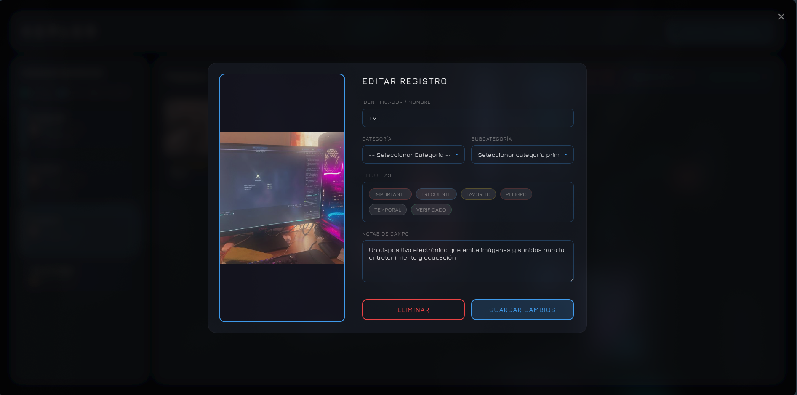

<div align="center">

# 🔭 K E P L E R

### Sistema de Reconocimiento Visual Estelar con IA

<p align="center">
  
  
  
</p>

```
██╗  ██╗███████╗██████╗ ██╗     ███████╗██████╗ 
██║ ██╔╝██╔════╝██╔══██╗██║     ██╔════╝██╔══██╗
█████╔╝ █████╗  ██████╔╝██║     █████╗  ██████╔╝
██╔═██╗ ██╔══╝  ██╔═══╝ ██║     ██╔══╝  ██╔══██╗
██║  ██╗███████╗██║     ███████╗███████╗██║  ██║
╚═╝  ╚═╝╚══════╝╚═╝     ╚══════╝╚══════╝╚═╝  ╚═╝
```
</div>

---

## � Acerca del Proyecto

**KEPLER** es una demostración conceptual y técnica de una interfaz de exploración (HUD) asistida por Inteligencia Artificial, diseñada originalmente con una estética *Sci-Fi Glassmorphism* inspirada en cascos espaciales y paneles de mando futuristas.

El proyecto nació como una simulación web interactiva para visualizar cómo un explorador planetario o geólogo de campo moderno interactuaría con su entorno mediante el uso de modelos de Machine Learning on-edge. KEPLER está evolucionando actualmente de ser una simple "Prueba de Concepto en el navegador" para convertirse en un ecosistema de software dedicado:
- Un **Cliente Desktop** ultra-ligero (Electron) que se conecta a un backend local de Python para procesar visión artificial (YOLOv26) a extrema velocidad.
- Una **Unidad de Campo Móvil** nativa (React Native) para verdadera exploración en terreno usando las cámaras del hardware del celular.

Con componentes construidos desde cero en HTML/CSS Vanilla puro integrados mediante Vite, el diseño de KEPLER es radicalmente modular. Integra widgets de mapas satelitales tácticos 3D, chat conversacional nativo con LLMs (Llama 3/Mistral), biometría espacial simulada y sistemas de base de datos distribuidas (Supabase).

---

## �🌍 El Problema

La exploración de entornos desconocidos —ya sea un terreno geológico remoto, un paisaje extraterrestre simulado o una zona de difícil acceso— enfrenta un obstáculo fundamental: **la brecha entre la percepción humana y la inteligencia analítica disponible en campo.**

Hoy, un explorador en terreno se encuentra con estas limitaciones:

- **Datos crudos sin contexto.** Una roca, un mineral, una formación: el ojo humano observa, pero sin un laboratorio no puede identificar, clasificar ni comparar en tiempo real.
- **Conectividad intermitente o nula.** En zonas remotas, enviar datos a la nube para análisis significa esperar minutos u horas, o simplemente no tener respuesta.
- **Herramientas fragmentadas.** GPS en una app, cámara en otra, notas en papel, análisis después en la oficina. No existe un sistema unificado que conecte la visión, la ubicación, la telemetría y la inteligencia artificial en un solo flujo de trabajo.
- **Pérdida de conocimiento.** Sin un registro estructurado e inmediato, los hallazgos se pierden, se descontextualizan o nunca se correlacionan con observaciones anteriores.

El resultado: **un explorador con tecnología del siglo XXI pero flujos de trabajo del siglo XX.**

---

## 🚀 La Solución: KEPLER

**KEPLER** es una plataforma integral de exploración asistida por Inteligencia Artificial que actúa como el **sistema operativo de campo** para exploradores de próxima generación.

Cierra la brecha entre la recolección de datos crudos y la **inteligencia accionable en tiempo real**, fusionando cuatro capacidades críticas en una sola interfaz:

### 🔬 1. Visión que Comprende
No es solo una cámara. KEPLER ejecuta modelos de detección de objetos (YOLOv11) **directamente en el dispositivo** del explorador — sin necesidad de internet. Apunta tu cámara a una roca y en milisegundos sabrás qué tipo de mineral es, su relevancia geológica y si ya lo has catalogado antes.

### 🧠 2. Un Cerebro que Razona
El módulo **Cortex AI** (LLM local con Mistral 7B) no solo detecta, sino que *entiende*. Puedes preguntarle: _"¿Qué relación tiene este mineral con los que encontré en la misión anterior?"_ y recibirás un análisis contextual completo con datos de tu historial de exploración.

### 🗺️ 3. Mapeo que Conecta
Cada hallazgo se geolocaliza automáticamente en un **mapa táctico 3D**. Visualiza patrones de distribución, compara zonas exploradas, y genera descripciones de terreno asistidas por IA combinando GPS + imágenes satelitales + modelos de lenguaje.

### 🔄 4. Sincronización que No Falla
Opera desde el **Centro de Control** (Web/Desktop) para planificar misiones, o desde la **Unidad de Campo** (Mobile AR) para ejecutarlas. Todo se sincroniza en tiempo real cuando hay conexión, y sigue funcionando offline cuando no la hay.

> 🎯 **Misión:** *"Iluminar lo desconocido"* — Transformar lo inexplorado en conocimiento estructurado mediante la fusión de visión artificial y exploración humana.

---

## ⚙️ Arquitectura Híbrida (Edge + Cloud)

KEPLER no depende de la nube para funcionar. Su arquitectura está diseñada para **operar en el borde** (edge computing) con sincronización inteligente:

```
┌────────────────────────────────────────────────────────┐
│                    CENTRO DE CONTROL                   │
│        Web (Vite + JS) · Desktop (Electron)            │
│  ┌──────────┐ ┌──────────┐ ┌──────────┐ ┌───────────┐ │
│  │Dashboard │ │ Archives │ │ HoloMap  │ │ AI Chat   │ │
│  │Telemetría│ │ Búsqueda │ │ 3D Tác.  │ │ Streaming │ │
│  └──────────┘ └──────────┘ └──────────┘ └───────────┘ │
└──────────────────────┬─────────────────────────────────┘
                       │ WebSocket / REST
              ┌────────┴────────┐
              │   SUPABASE DB   │
              │  PostgreSQL +   │
              │  Vector Search  │
              │  + Realtime     │
              └────────┬────────┘
                       │
┌──────────────────────┴─────────────────────────────────┐
│                   UNIDAD DE CAMPO                      │
│              Mobile (React Native / Expo)              │
│  ┌──────────┐ ┌──────────┐ ┌──────────┐ ┌───────────┐ │
│  │ AR Cam   │ │ GPS +    │ │ Offline  │ │ YOLO      │ │
│  │ Scanner  │ │ Mapping  │ │ Cache    │ │ On-Device │ │
│  └──────────┘ └──────────┘ └──────────┘ └───────────┘ │
└────────────────────────────────────────────────────────┘
              ┌────────────────────┐
              │   BACKEND IA       │
              │  FastAPI + Python  │
              │  Mistral 7B (LLM)  │
              │  CLIP (Embeddings) │
              │  Ollama Runtime    │
              └────────────────────┘
```

---

---

## 📸 Galería del Sistema

<div align="center">
  
  <p><em>Vista Principal del Centro de Control</em></p>
  
  <br>

  
  <p><em>Interfaz de Análisis de Misión</em></p>

  <br>

  <div style="display: flex; justify-content: center; gap: 2%; margin-top: 20px;">
    <div style="width: 49%;">
      
      <p><em>Visualización Móvil</em></p>
    </div>
    <div style="width: 49%;">
      
      <p><em>Interfaz AR</em></p>
    </div>
  </div>
</div>

---

## 🛠️ Capacidades del Sistema

| Módulo | Estado | Descripción |
|--------|--------|-------------|
| 🔭 **Visual Core** | ✅ Activo | Detección de objetos en tiempo real (YOLOv11 Nano en browser). |
| 🧠 **Cortex AI** | ✅ Activo | Análisis semántico profundo (CLIP + Mistral 7B). |
| 💬 **AI Chat** | ✅ Activo | Chat streaming con intents inteligentes, tablas comparativas y títulos contextuales. |
| 🗺️ **HoloMap** | ✅ Activo | Mapa táctico 3D (MapLibre) con filtros Odradek y tracking GPS. |
| 📊 **Dashboard** | ✅ Activo | Telemetría vital, gestión de misiones y chat integrado. |
| 📂 **Archives** | ✅ Activo | Base de datos vectorial de hallazgos. |
| 🔔 **Realtime** | ✅ Activo | Alertas en tiempo real vía WebSocket (Supabase Realtime). |
| 👤 **Perfil** | ✅ Activo | Gestión de usuario y personalización de avatar del asistente IA. |
| 📱 **Mobile AI** 
```| ✅ Nuevo | Optimizaciones automáticas para móvil (256px, 1 hilo, sin precarga). |
| 📍 **GPS + IA** | ✅ Nuevo | Descripción automática de zona con GPS + Nominatim + Mistral. |

---

## 📱 Novedades v0.5.0 (Mobile & GPS)

### Optimizaciones Móviles Automáticas
El sistema detecta dispositivos móviles y ajusta la IA automáticamente:
- **Resolución reducida:** 256px (vs 640px en desktop) = ~85% menos RAM
- **Single-thread:** 1 hilo CPU para evitar errores de SharedArrayBuffer en HTTP
- **Precarga desactivada:** El modelo YOLO se carga bajo demanda, no en la pantalla de carga
- **WebGPU desactivado:** Forzado a WASM para máxima compatibilidad

### Descripción de Zona con GPS + IA
Al iniciar una misión, el sistema:
1. 📍 Obtiene tu ubicación GPS
2. 🗺️ Convierte coordenadas a nombre de lugar (Nominatim/OpenStreetMap)
3. 🤖 Genera descripción con Mistral 7B incluyendo clima, terreno y fauna

La descripción se guarda con la misión para uso en reportes y chat.

---

## 💬 Sistema de Chat IA

### Características v0.4:
- **Streaming en tiempo real**: Respuestas fluidas con animación typewriter.
- **Detección de Intents**: Sistema ReAct que identifica automáticamente consultas de misiones, objetos, comparaciones, etc.
- **Tablas Comparativas**: Genera tablas markdown al pedir comparaciones entre misiones u objetos.
- **Historial en Español**: Títulos generados automáticamente con emojis temáticos (🔬, 🗺️, 🚀, 💎).
- **Avatar Personalizable**: Elige entre presets de emojis o una imagen personalizada desde tu perfil.
- **Modal Móvil**: Interfaz adaptada con FAB y menú hamburguesa funcional.

---

## 🔔 Sistema de Notificaciones

KEPLER incluye un sistema de notificaciones en tiempo real para mantener a los usuarios informados de eventos del sistema:

### Características:
- **Notificaciones Globales**: Funcionan en todas las secciones (Dashboard, Archivos, Taxonomía, AR).
- **Sincronización Cloud**: Guardado en Supabase (`user_notifications`) para acceso cross-device.
- **Modo Offline**: Fallback automático a localStorage si no hay conexión.
- **Bitácora Avanzada**: Filtros por tipo (Critical, Alert, Success) y contadores dinámicos.
- **Timeline**: Agrupación cronológica inteligente.
- **Borrado Seguro**: Confirmación mediante modales del sistema (System Modals).
- **Atribución de Usuario**: Cada notificación muestra quién realizó la acción (`👤 por [usuario]`).

### Tipos de Notificaciones:
| Tipo | Icono | Duración |
|------|-------|----------|
| **Critical** | 🚨 | Persistente (requiere cierre manual) |
| **Warning** | ⚠️ | 7 segundos |
| **Success** | ✅ | 4 segundos |
| **Info** | ℹ️ | 5 segundos |

### Eventos Realtime Monitoreados:
- 📡 Nueva misión creada
- 🚀 Misión activada
- ✅ Misión completada (con estadísticas detalladas)
- ⚠️ Misión eliminada

### Acceso a la Bitácora:
- **Desktop**: Clic en el ícono de campana 🔔 en el header
- **Mobile**: Menú hamburguesa → "🔔 Notificaciones"

---

## 📚 Documentación Técnica

La documentación ha sido reorganizada para facilitar el desarrollo:

*   **[🎨 Frontend Architecture](docs/frontend.md)**: UI Design, Animaciones Holográficas, Vite.
*   **[🗺️ Map System](docs/map.md)**: MapLibre, Odradek Theme, Tile Proxy & Layers.
*   **[⚙️ Backend & AI Services](docs/backend.md)**: FastAPI, Python, Mistral 7B, CLIP.
*   **[⚡ Database & Cloud](docs/supabase.md)**: Esquema PostgreSQL, Auth, Vector Search.
*   **[🧠 Hybrid AI System](docs/ia.md)**: Detalles sobre la integración Edge-Cloud AI.
*   **[🔔 Realtime, Notificaciones y Sync Offline](docs/realtime.md)**: WebSocket, Alertas, Bitácora, Sincronización.
*   **[📊 Dashboard & UI Components](docs/dashboard.md)**: Header Refactor, Command Menu, System Status.
*   **[⏳ Loading & Caching System](docs/loading-system.md)**: Initialization tasks, Model Preloading.

---

## 🚀 Inicio Rápido

### Requisitos Previos
*   **Docker** (Recomendado para servicios backend/db)
*   **Node.js 18+**
*   **Ollama** (Ejecutándose en puerto 11434 para funciones de chat)

### Ejecución Automática

```bash
# Iniciar stack completo (DB + Backend + Frontend)
./start-dev.sh
```

### 🌐 Acceso Remoto (Salidas de Campo)

Para acceder a KEPLER desde tu móvil mientras estás fuera:

```bash
# Opción 1: Todo en uno (inicia servicios + túneles)
./start-remote.sh

# Opción 2: Solo túneles (si ya tienes los servicios corriendo)
./tunnel.sh start
```

El script mostrará URLs públicas temporales y un código QR para escanear con tu móvil.

Para más detalles, consulta la **[Guía de Inicio](docs/guia-inicio.md)**.

---

## 📁 Estructura del Proyecto

```
KEPLER/
├── apps/
│   ├── web/               # Interfaz Holográfica (Vite + Vanilla JS)
│   │   └── src/features/  # Módulos: AR, Dashboard, Login, Archives
│   ├── mobile/            # App React Native (Expo)
│   │   └── src/
│   │       ├── features/  # Dashboard, Map (modular)
│   │       ├── screens/   # Re-exports desde features
│   │       ├── components/# Header compartido, Icons
│   │       └── hooks/     # useSharedMenu, useApi
│   └── desktop/           # Electron wrapper
├── packages/
│   └── shared/            # Tipos, constantes, utilities
├── backend/               # Cerebro Analítico (FastAPI + Python)
│   └── app/               # Lógica de IA y Endpoints
├── deployment/            # Configuración Docker
└── docs/                  # Manuales y Referencias
```

---

## 🤝 Contribuciones

El proyecto es Open Source bajo la licencia MIT. Las contribuciones son bienvenidas, especialmente en áreas de:
*   Optimización de inferencia en navegador (WASM).
*   Expansión del dataset geológico.
*   Mejoras de accesibilidad en la UI holográfica.

---

<div align="center">

**KEPLER PROJECT**
*Explorando lo desconocido, un frame a la vez.*

Desarrollado con 💙 y ☕ por el equipo de ingeniería.

</div>